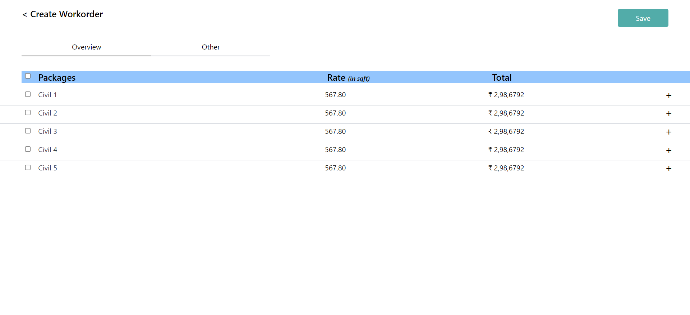
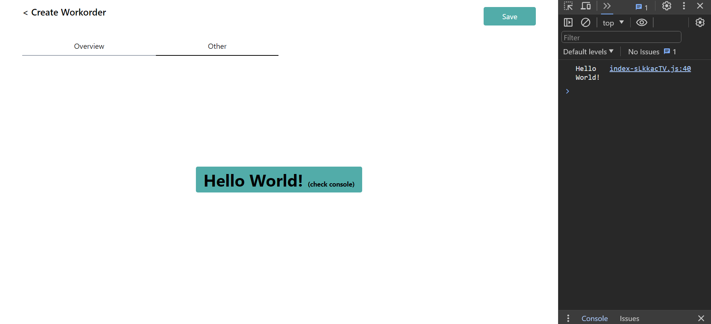
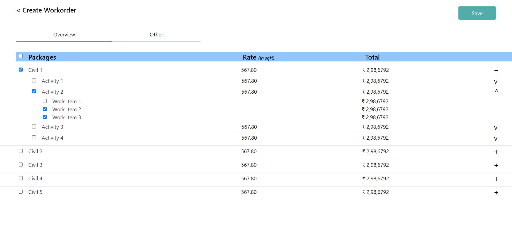
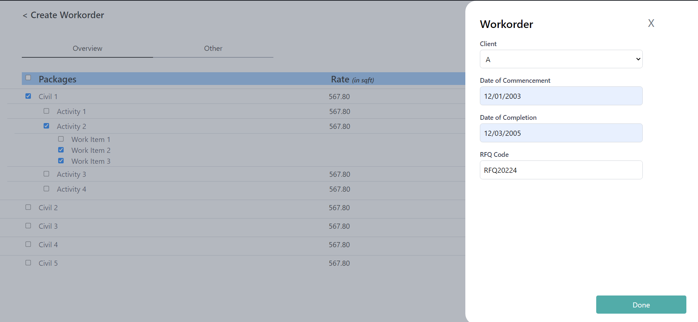
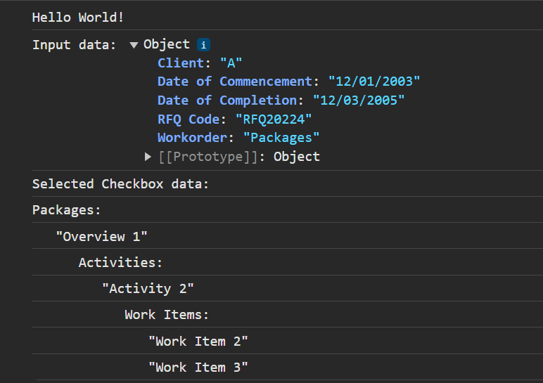

# OfficeBanao Internship Assignment

## Project Overview

This project is my submission for the Frontend Intern role at OfficeBanao. The assignment involved creating a dynamic screen for work order creation, emphasizing usability and functionality using React and Tailwind CSS.

## Features

- **Tabs Implementation:**
  - Two main tabs - Overview & Other.
  - Clicking on the 'Other' tab displays a simple "Hello World!" message.

- **Expand/Collapsible Feature:**
  - Implemented a feature to expand/collapse activities or work-items under the Civil package for better organization.

- **Selection Checkboxes:**
  - Checkboxes for selecting/deselecting all work items.
  - Individual checkboxes for granular selection.

- **Save Selection Functionality:**
  - Upon selecting items, the 'Save Selection' button triggers an overlay.
  - Overlay includes fields for client selection (A, B, C dropdown), manual input for commencement/completion dates with format validation, and manual input for RFQ code.
  - Clicking 'Done' prints the input data on the console.

## Output Screenshots

#### Workorder Page - Overview Tab

#### Workorder Page - Other Tab

#### Workorder Page - Checkboxes

#### Workorder Page - Save Overlay

#### Console Output

## Technology Stack

- React: Leveraging the power of React for dynamic and efficient UI.
- Tailwind CSS: Ensuring a sleek and responsive design.

## Project Links

- GitHub Repository: [sourabh-bhatt/officebanao](https://github.com/sourabh-bhatt/officebanao)
- Deployment Link: [OfficeBanao Deployment](https://officebanao-six.vercel.app/)

## How to Run

1. Clone the repository: `git clone https://github.com/sourabh-bhatt/officebanao.git`
2. Install dependencies: `npm install`
3. Run the application: `npm run dev`

## Feedback and Contributions

Feedback and contributions are welcome! Feel free to open an issue or create a pull request.

---

**Connect with me:**
- LinkedIn: [Sourabh Bhatt](https://linkedin.com/in/sourabh-bhatt)
- Twitter: [Sourabh Bhatt](https://twitter.com/sourabh__bhatt)
- GitHub: [sourabh-bhatt](https://github.com/sourabh-bhatt)
- Hashnode: [Sourabh Bhatt](https://sourbhatt.hashnode.dev)
